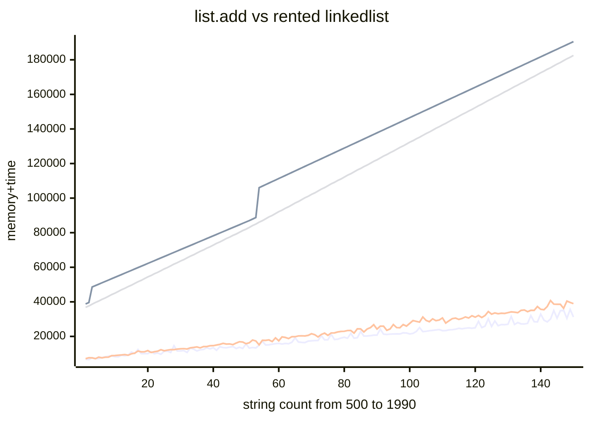

lines:
- list.add mem
- linkrent mem
- linkrent time
- list.add time
  

```mermaid
xychart
  title "list.add vs rented linkedlist<string[16]>"
  y-axis "memory+time"
  x-axis "string count from 500 to 1990"
  line [6802.15,6595.72,7710.96,7172.1,7176.29,7735.19,8232.37,8511.09,8691.16,8239.13,8215.07,9077.52,8826.24,9138.79,10981.27,10108.25,12428.13,10025.11,10031.38,10019.33,11156.96,10016.82,10414.81,9667.2,11351.25,11499.2,10719.21,14641.42,11571.12,11603.66,11812.07,10701.27,13310.73,12646.92,11587.12,12251.33,12445.35,13397.76,12790.64,13447.73,11960.53,14059.4,13532.19,13412.95,13807.5,14092.72,13003.89,13724.72,13061.2,15688.65,13202.36,13590.48,13303.98,14960.38,17148.09,15051.47,15156.62,15528.11,15784.59,15962.88,15564.47,15925.92,15743.42,16565.7,19209.68,16784.69,16543.08,16450.73,17284.62,17475.38,17567.65,17633.73,20398.08,18030.42,18034.47,21268.62,18195.82,18380.76,19049.3,19513.22,18927.41,21735.32,18981.83,19239.7,22812.59,20212.94,20276.81,20422.33,20727.27,20721.11,24248.25,21307.5,21110.56,21332.09,21395.07,21501.66,21420.67,22093.58,21973.85,21447.71,21746.94,22803.23,25102.39,22776.66,22977.03,23267.29,23501.84,23724.17,23952.67,23321.32,23388.54,23773.99,23883.37,24174.61,24697.9,24427.88,24728.76,24950.96,24716.14,24994.89,28692.26,25113.42,25946.11,30168.09,25745.89,28938.65,26220.07,26855.46,26802.31,27039.48,31510.74,26915.47,27994.45,27279.48,27183.29,27551.63,31997.2,28508.3,28381.68,32888.62,29388.13,28402.51,30039.81,35007.71,30525.32,34845.97,35170.9,30429.44,35628.66,31242.81]
  line [38784,39584,48600,49400,50200,51000,51800,52600,53400,54200,55000,55800,56600,57400,58200,59000,59800,60600,61400,62200,63000,63800,64600,65400,66200,67000,67800,68600,69400,70200,71000,71800,72600,73400,74200,75000,75800,76600,77400,78200,79000,79800,80600,81400,82200,83000,83800,84600,85400,86200,87000,87880,88760,106048,106928,107808,108688,109568,110448,111328,112208,113088,113968,114848,115728,116608,117488,118368,119248,120128,121008,121888,122768,123648,124528,125408,126288,127168,128048,128928,129808,130688,131568,132448,133328,134208,135088,135968,136848,137728,138608,139488,140368,141248,142128,143008,143888,144768,145648,146528,147408,148288,149168,150048,150928,151808,152688,153568,154448,155328,156208,157088,157968,158848,159728,160608,161488,162368,163248,164128,165008,165888,166768,167648,168528,169408,170288,171168,172048,172928,173808,174688,175568,176448,177328,178208,179088,179968,180848,181728,182608,183488,184368,185248,186128,187008,187888,188768,189648,190528]
  line [7113.22,7673.85,7602.93,7118.96,8015.89,7621.04,7946.37,8043.65,8865.22,8933.01,9140.79,9287.48,9477.99,9118.35,9928.68,10299.16,11541.27,11086.68,11094.12,11793.18,10708.64,11130.24,11438.27,12305.71,11713.24,12065.83,12324.76,12334.27,12652.32,12833.65,12928.37,12726.46,13385.3,13630.56,13933.77,13376.18,14101.09,14131.31,14591.93,14642.16,15023.71,15401.34,16001.51,15577.45,15653.64,15234.08,16167.36,16938.25,16722.98,15760.31,16317.55,17913.96,17369.99,15153.26,17784.64,17705.52,17971.4,17013.74,19154.96,17450.08,19717.84,19403.05,18767.1,19838.6,19819.47,20291.82,20352.12,20264.42,20618.31,21571.98,20981.02,19703.1,21135.66,21885.78,20631.14,21999.02,22047.32,22571.49,22869.13,22977.48,23394.84,23405.93,21921.57,24382.12,24328.72,22580.54,24292.18,25085.16,26776.02,24230.49,25922.16,25931.38,23530.14,24297.69,26857.14,25104.31,25025.68,26852.19,25964.88,27532.55,29163.6,28709.75,28283.56,31244.56,29250.46,28517.11,30170.99,29090.01,29465.86,30696.26,27700.11,29036.04,30278.43,30586.73,29828.75,30387.6,31270.47,30646.04,31955.61,31128.67,32142.9,30939.22,32060.53,34399.51,32888.51,33577.29,33100.18,33409.26,33297.1,33731.98,34208.65,34013.81,33719.93,35057.06,35281.8,34297.16,35093.95,35069.71,37278.41,35689.14,35455.89,37298.71,40755.9,38680.68,38597.2,38584.81,36245.64,40453.63,39642.11,38953.35]
  line [36832,37632,38632,39632,40432,41432,42232,43232,44232,45032,46032,47032,47832,48832,49632,50632,51632,52432,53432,54432,55232,56232,57032,58032,59032,59832,60832,61832,62632,63632,64432,65432,66432,67232,68232,69232,70032,71032,71832,72832,73832,74632,75632,76632,77432,78432,79232,80232,81232,82032,83032,84112,84992,86072,86952,88032,89112,89992,91072,92152,93032,94112,94992,96072,97152,98032,99112,100192,101072,102152,103032,104112,105192,106072,107152,108232,109112,110192,111072,112152,113232,114112,115192,116272,117152,118232,119112,120192,121272,122152,123232,124312,125192,126272,127152,128232,129312,130192,131272,132352,133232,134312,135192,136272,137352,138232,139312,140392,141272,142352,143232,144312,145392,146272,147352,148432,149312,150392,151272,152352,153432,154312,155392,156472,157352,158432,159312,160392,161472,162352,163432,164512,165392,166472,167352,168432,169512,170392,171472,172552,173432,174512,175392,176472,177552,178432,179512,180592,181472,182552]
%% x-axis [500,510,520,530,540,550,560,570,580,590,600,610,620,630,640,650,660,670,680,690,700,710,720,730,740,750,760,770,780,790,800,810,820,830,840,850,860,870,880,890,900,910,920,930,940,950,960,970,980,990,1000,1010,1020,1030,1040,1050,1060,1070,1080,1090,1100,1110,1120,1130,1140,1150,1160,1170,1180,1190,1200,1210,1220,1230,1240,1250,1260,1270,1280,1290,1300,1310,1320,1330,1340,1350,1360,1370,1380,1390,1400,1410,1420,1430,1440,1450,1460,1470,1480,1490,1500,1510,1520,1530,1540,1550,1560,1570,1580,1590,1600,1610,1620,1630,1640,1650,1660,1670,1680,1690,1700,1710,1720,1730,1740,1750,1760,1770,1780,1790,1800,1810,1820,1830,1840,1850,1860,1870,1880,1890,1900,1910,1920,1930,1940,1950,1960,1970,1980,1990]
```
